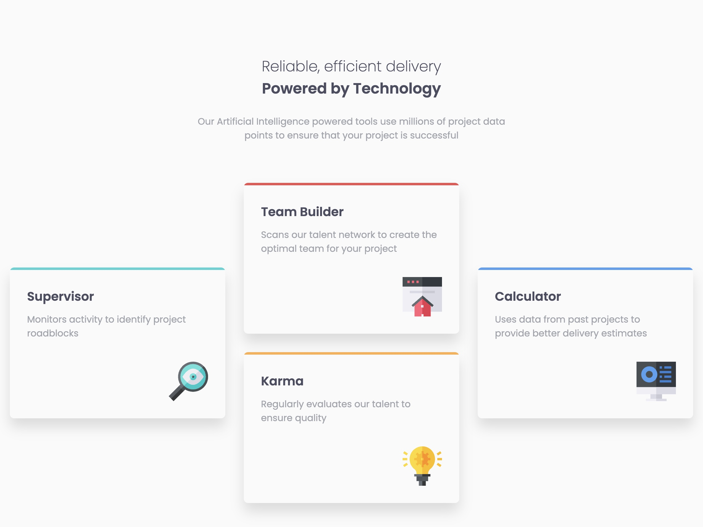
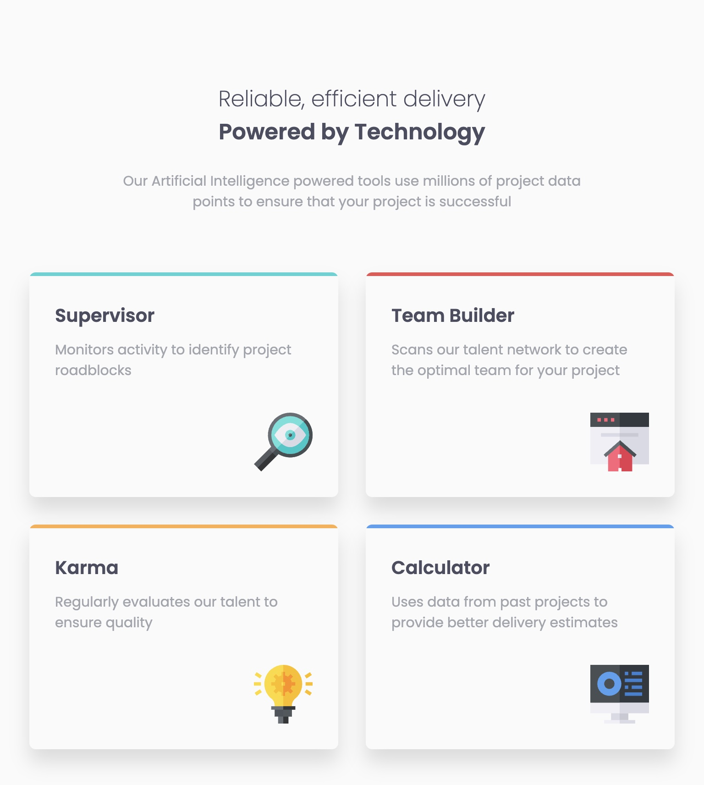

# Frontend Mentor - Four card feature section solution

This is a solution to the [Four card feature section challenge on Frontend Mentor](https://www.frontendmentor.io/challenges/four-card-feature-section-weK1eFYK). Frontend Mentor challenges help you improve your coding skills by building realistic projects. 

## Table of contents

- [Overview](#overview)
  - [The challenge](#the-challenge)
  - [Screenshots](#screenshots)
  - [Links](#links)
- [My process](#my-process)
  - [Built with](#built-with)
  - [What I learned](#what-i-learned)
  - [Continued development](#continued-development)
- [Author](#author)

## Overview

### The challenge

Users should be able to:

- View the optimal layout for the site depending on their device's screen size

### Screenshots

### Links

- Solution URL: [https://github.com/webdevbynight/four-card-feature-section-master](https://github.com/webdevbynight/four-card-feature-section-master)
- Live Site URL: [https://webdevbynight.github.io/four-card-feature-section-master/](https://webdevbynight.github.io/four-card-feature-section-master/)

## My process

### Built with

- Semantic HTML5 markup
- CSS (via SCSS)
  - custom properties
  - Grid layout
  - pseudo-classes
  - pseudo-elements
  - CSS sprite
- Mobile-first workflow

### What I learned

Concerning the coloured top border of each card, when the border width is less than the radius of rounded corners, the border has to be displayed in a child element if we do not want the border to be rounded at the corners.

### Continued development

For this time, I did not feel I spent too much time carrying out this challenge.

## Author

- Website - [@webdevbynight](https://github.com/webdevbynight)
- Frontend Mentor - [@webdevbynight](https://www.frontendmentor.io/profile/webdevbynight)
